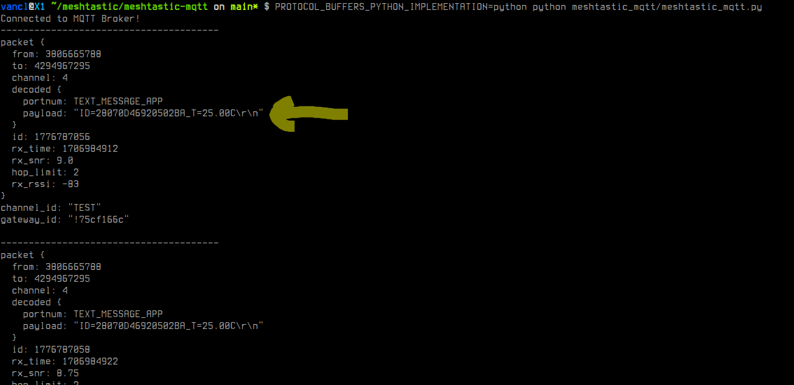
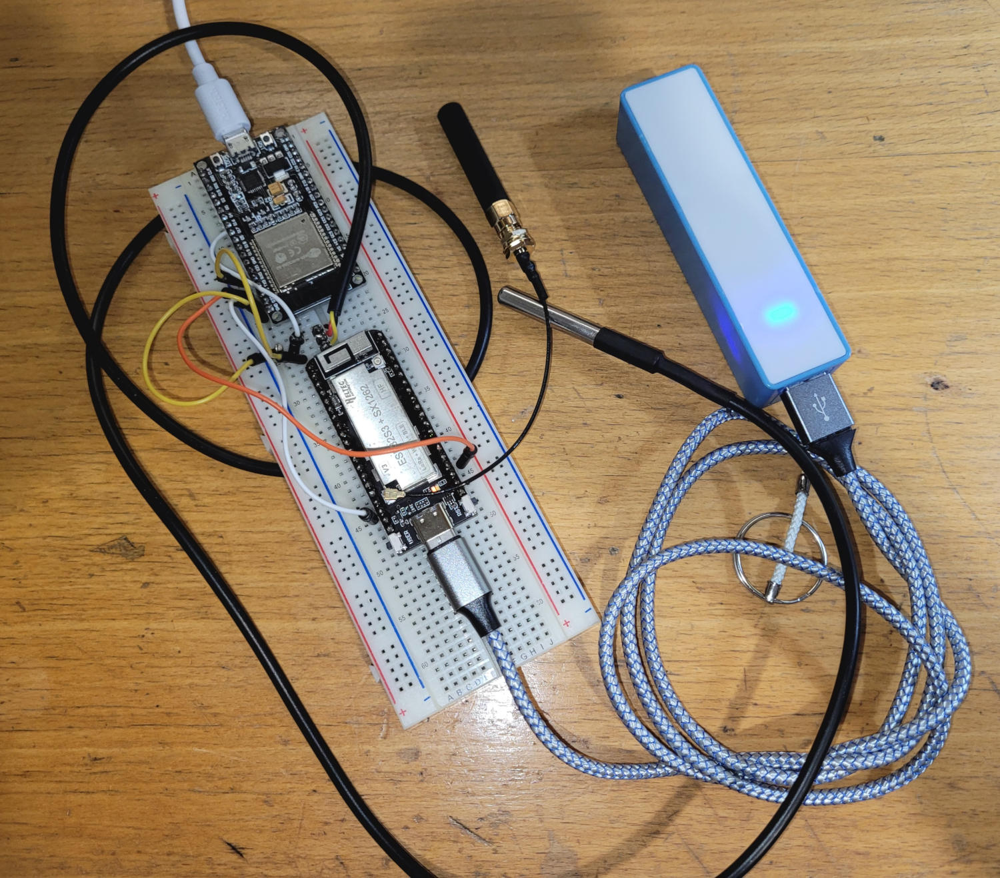
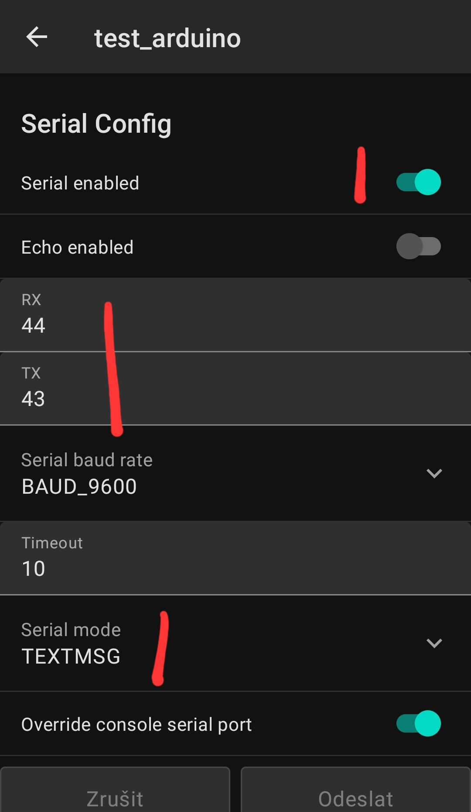
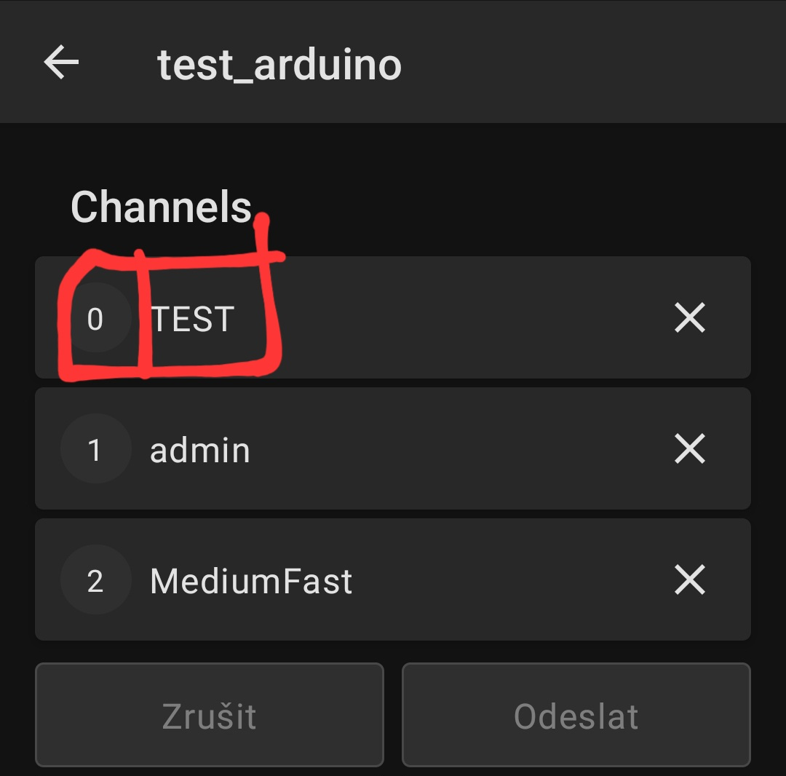
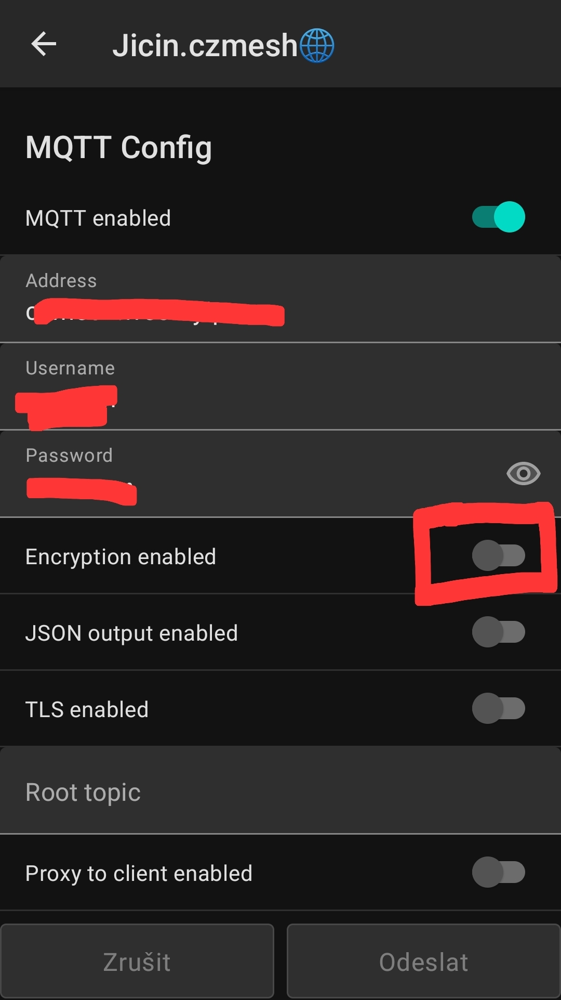

# Instalace

```bash
pip install -r requirements.txt
```

# Spusteni
```bash
PROTOCOL_BUFFERS_PYTHON_IMPLEMENTATION=python python meshtastic_mqtt/meshtastic_mqtt.py
```

# Ukazka

Jedno ESP32 (program v Arduino) ma pripojeny DS18B20 teplomer a do serioveho portu posila string:
```
ID=28070D46920502BA_T=25.00C
```
je to id teplomeru a namerena teplota. Pres seriovy port je pripojeny [Wireless Stick Lite(V3)](https://heltec.org/project/wireless-stick-lite-v2/) s nahranym Meshtastic firmwarem.

Vystup app:



Hardware:



Nastaveni Serial (node bez WiFi):



cisla pinu seriaku jsou podle:


**Kanal s cislem 0 se pouzije pro odesilani dat ze serioveho portu**:



Nastaveni MQTT v Meshtastic node (node s WiFi), **`encryption` musi byt vypnute**:




## TO DO

Pridat podporu desifrovani zprav.
